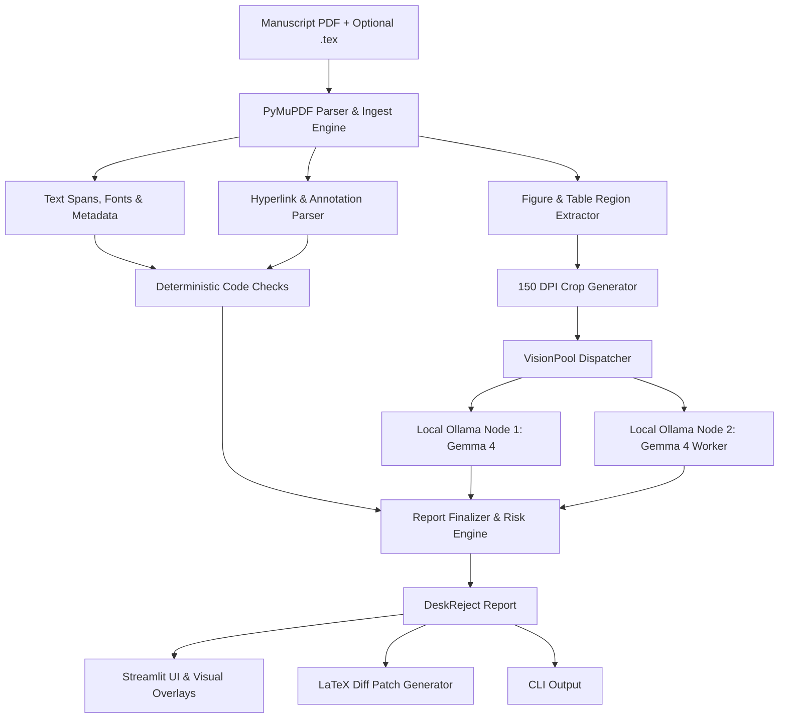

# DeskReject Guard

> Local, fully offline pre-flight auditor for academic manuscripts that catches visual, anonymity, and formatting desk-reject flaws before submission.

## Team

**Team Name:** Tomato Chutney


| Member | Contribution |
| ------ | ------------ |
| Krishiv S Iyer (Team Leader) | Vision client, Ollama worker pool, geometry/color checks, and image anonymity |
| Aditya Vineeth | Streamlit UI, visual overlays, synthetic test samples, and documentation |
| Karthik M G | Text checks (anonymity, mentions, sequencing, statements) and LaTeX patch generator |
| Sibi Chakravarthi | Core PDF parsing, ingest pipeline, report finalization, and evaluation suite |


## Problem Statement

### The Problem

Academic manuscripts submitted to top conferences and journals must adhere to strict formatting, anonymity, and submission guidelines. Authors frequently encounter desk-rejections—rejection prior to peer review—due to preventable formatting and anonymity violations: author identities leaked in document metadata or hyperlinked repositories, university crests and lab logos embedded in system architecture diagrams, figure citations appearing out of order, missing mandatory ethics or reproducibility statements, unreadable tiny chart text, or captions omitting sub-panel descriptions.

### Why We Chose This Problem

Navigating multi-page author guidelines is tedious and error-prone. Existing grammar and proofreading tools operate strictly on raw text, leaving them completely blind to visual figures, chart annotations, PDF metadata, and layout geometry. Furthermore, unpublished research manuscripts are strictly confidential; authors cannot upload sensitive pre-prints to third-party cloud AI APIs. Solving this with a 100% local, privacy-preserving visual audit tool prevents months of wasted submission cycles.

## Solution

DeskReject Guard is a local, privacy-preserving manuscript pre-flight auditor. Authors provide their compiled PDF (and optionally their `.tex` source) and select a venue preset. The system performs full document ingestion, runs deterministic code-based geometric/text checks alongside local Gemma 4 vision models, flags critical desk-reject risks, renders visual bounding-box overlays over PDF pages, and generates ready-to-apply LaTeX patch diffs.

### Key Features

- **Multi-Layer Anonymity Audit:** Identifies author details across running text, PDF document metadata properties, clickable hyperlink URLs, and scans figures with Gemma 4 vision for university crests, lab logos, and author affiliations.
- **Figure-Caption Parity & Sequencing:** Verifies that all sub-panels (e.g., (a), (b), (c)) are described in captions, detects unreferenced figures/tables, and flags figures cited out of chronological order.
- **Visual Overlays & Interactive Dashboard:** Renders high-resolution PDF pages with color-coded bounding boxes and badge markers highlighting exact error locations.
- **LaTeX Patch Suggestions:** Automatically generates precise `.tex` unified diffs to fix common text and metadata anonymity violations.
- **100% Offline & Distributed Inference:** Enforces zero external network traffic via NetGuard while distributing vision inference across multiple local worker laptops via Ollama.

## Innovation and Differentiation

- **"The Model Reads, Code Decides":** Numerical comparisons, coordinate geometry, font sizes, regex patterns, and threshold validations are executed deterministically by code. Gemma 4 vision is invoked only for visual recognition tasks that code cannot resolve alone (such as finding logos inside diagrams or reading raster panel labels).
- **Inspection of Hidden & Visual Document Layers:** Unlike text-only checkers, DeskReject Guard inspects embedded raster images, vector line art, hyperlink destination annotations, and document metadata streams.
- **Strict Local Privacy Guarantee:** Designed to run 100% offline. Built-in network guards guarantee and verify that zero manuscript bytes or findings ever leave the local network.
- **Multi-Node Local LAN Fan-out:** Distributes parallel figure crop vision tasks across multiple team laptops on the same Wi-Fi network, cutting audit latency to under a minute without cloud compute.

## Technical Implementation

### Architecture



### Technology Stack


| Category        | Technologies                |
| --------------- | --------------------------- |
| Frontend        | Streamlit, Pillow (PIL), Custom CSS & HTML Overlays |
| Backend         | Python 3.12, PyMuPDF (fitz), Pydantic v2, PyYAML |
| Database        | N/A (Local JSON reports & SHA-256 disk cache) |
| AI / ML         | Gemma 4 (Gemma 4 12B/4B IT QAT via Ollama), Qwen2.5-Coder |
| Infrastructure  | Local Ollama multi-worker LAN cluster, NetGuard HTTP isolation |
| APIs / Services | N/A (100% offline, zero cloud API dependencies) |


### How It Works

1. **Document Ingestion:** PyMuPDF extracts text spans with exact font sizes, bounding boxes, document metadata properties, link annotations, headings, and isolates figure/table bounding regions.
2. **Rule & Vision Auditing:**
   - **Text & Metadata Engine:** Scans for unblinded author names, institutional affiliations, self-referential acknowledgements, out-of-order figure citations, and missing mandatory sections (e.g., Broader Impacts, Ethics, Reproducibility).
   - **Vision Engine:** Generates 150 DPI crops of detected figure regions and dispatches them across the local Ollama `VisionPool` to detect university logos, lab badges, and panel discrepancies.
3. **Risk Scoring & Aggregation:** Consolidates findings into `fatal`, `warning`, and `info` severities, computes an overall manuscript risk score, and maps findings to page coordinates.
4. **Interactive Visualization & Remediation:** Displays findings on an interactive Streamlit UI, renders bounding-box overlays directly onto the page images, and outputs copyable LaTeX patches.

### Technical Decisions

- **Deterministic Logic Priority:** Kept all threshold, sequence, and string matching logic in deterministic Python functions for zero hallucination and high execution speed.
- **Normalized Coordinate System:** Used standard PDF point coordinates with top-left origin across all ingestion, check, and overlay modules for exact visual alignment.
- **Local Network Guard:** Implemented a strict HTTP client wrapper (`netguard.py`) that blocks any outbound traffic not explicitly bound to configured local Ollama endpoints.

## Implementation During the Hackathon

During the hackathon, the team built DeskReject Guard from scratch:
- Developed the complete PyMuPDF ingestion and layout extraction pipeline.
- Implemented 8 modular auditing checks covering anonymity, figure-caption parity, sequencing, mandatory statements, and legibility.
- Built a multi-node Ollama vision pool client with image hash caching and local network fan-out.
- Designed and built the Streamlit web dashboard with custom page overlay rendering and risk assessment gauges.
- Created synthetic academic manuscripts (`bad_paper.pdf` with 14 seeded desk-reject flaws and `clean_paper.pdf`) for validation and automated evaluation.
- Implemented a LaTeX unified diff patch generator to auto-correct common anonymity and formatting mistakes.

### Team Contributions

- **Krishiv S Iyer (Team Leader):** Architected the distributed Ollama `VisionPool`, implemented image anonymity detection with Gemma 4, raster DPI and legibility checks, and multi-worker LAN fan-out.
- **Aditya Vineeth:** Developed the interactive Streamlit UI dashboard, PDF page bounding box overlay renderer, synthetic sample papers (`bad_paper.pdf`, `clean_paper.pdf`), documentation, and demo.
- **Karthik M G:** Implemented text anonymity checks (blinded paper rules, metadata, links), figure citation sequencing, mandatory statement sweepers, and the LaTeX diff patch generator.
- **Sibi Chakravarthi:** Built the core PyMuPDF ingest engine, layout/figure region extractor, report finalizer/risk scoring engine, and the automated evaluation pipeline.

## Working Application

**Live Application:** Local Application (Offline / `streamlit run ui/app.py`)

The application runs locally to maintain strict privacy for confidential academic manuscripts. To test the application immediately without uploading external files, launch the app and click the **"Load sample"** button in the sidebar to run an instant audit on bundled test papers with seeded desk-reject defects.

## Demo Video

**Demo Video:** [[Video URL]](https://youtu.be/DSh-tXXG-Z8)


## Open Source and AI Usage

### AI / Models

- **Gemma 4 (via local Ollama):** Used strictly for visual understanding tasks—specifically detecting university crests, institution logos, author affiliations in figures, and reading sub-panel labels in raster figures.
- **Qwen2.5-Coder (via local Ollama):** Optional local assistant used for generating contextual LaTeX patch suggestions.

### Open Source Components

- **PyMuPDF (`fitz` - AGPL / Commercial):** High-performance PDF parsing, text span extraction, vector drawing analysis, and page rasterization.
- **Streamlit (Apache 2.0):** Interactive web dashboard and user interface.
- **Pydantic v2 (MIT):** Strict schema definition and data contract validation across all auditing stages.
- **Pillow / PIL (HPND):** Image cropping, DPI calculations, and visual overlay generation.
- **NumPy (BSD-3-Clause):** Image array processing and color accessibility preview simulations.
- **PyYAML (MIT):** Venue preset parsing and configuration management.
- **HTTPX (BSD-3-Clause):** Asynchronous HTTP communication with local Ollama worker endpoints.

## Setup and Usage

### Prerequisites

- Python 3.12+
- [Ollama](https://ollama.com/) installed and running locally
- Pull required local models:
  ```bash
  ollama pull gemma4:12b-it-qat
  ```

### Installation

```bash
git clone https://github.com/KrishivSIyer/deskreject-gaurd.git
cd deskreject-gaurd
python -m venv .venv
# On Windows PowerShell:
.venv\Scripts\Activate.ps1
# On Linux/macOS:
# source .venv/bin/activate
pip install -r requirements.txt
```

### Environment Variables

Copy `.env.example` to `.env` and configure local endpoints:

```env
OLLAMA_VISION_ENDPOINTS=gemma4:12b-it-qat@http://127.0.0.1:11434
TEXT_MODEL=gemma4:12b-it-qat@http://127.0.0.1:11434
CODER_MODEL=qwen2.5-coder:14b@http://127.0.0.1:11434
VISION_ENABLED=true
VISION_MAX_PX=1024
VISION_MAX_CROPS=12
VISION_TIMEOUT_S=90
CACHE_DIR=.cache
DEFAULT_PRESET=neurips-style-double-blind
```

### Running the Project

**Web Interface:**
```bash
streamlit run ui/app.py
```

**CLI Audit:**
```bash
python -m deskreject audit samples/bad_paper.pdf --preset neurips-style-double-blind
```

### Usage
We have hosted it on https://deskreject-guarder.streamlit.app/

1. Open the Streamlit web dashboard in your browser (`http://localhost:8501`).
2. Choose a venue preset from the sidebar (e.g., `neurips-style-double-blind` or `ieee-journal`).
3. Upload your manuscript PDF (and optional `.tex` source), or click **"Load sample"**.
4. Click **"Run audit"** to initiate the offline check pipeline.
5. Review identified fatal and warning risks in the **Findings** tab.
6. Inspect exact visual flaw locations under the **Page overlays** tab.
7. Copy or download `.tex` fixes from the **Patches** tab.

## Devpost Submission

**Devpost Project:** [Devpost Project URL]

## Credits and License

### Credits

- Major League Hacking (MLH) & Hacktoberfest Hack Day — Coimbatore 2026 organizers.
- Google DeepMind for the open-weight Gemma 4 model family.
- Ollama community for local inference tooling.

### License

This project is licensed under the [MIT License](LICENSE).

## Submission Checklist

- [x] Project title and description added
- [x] All team members listed
- [x] Problem clearly explained
- [x] Reason for choosing the problem explained
- [x] Solution and key features documented
- [x] Innovation and differentiation explained
- [x] Architecture included
- [x] Technical implementation documented
- [x] Work completed during the hackathon documented
- [x] Team contributions documented
- [x] Working application is functional
- [x] Live application link added where applicable
- [x] Demo video added
- [x] AI and open-source components documented
- [x] Setup and usage instructions tested
- [x] Challenges and learnings documented
- [x] Devpost submission completed
- [x] Devpost link added
- [x] Credits added
- [x] License added
- [x] Repository is organized and complete
