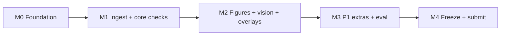

# DeskReject Guard: Implementation Plan

| | |
|---|---|
| Status | v2, 2026-10-08 — updated after M0/M1 review |
| Team | Four developers: Lane A (Sibi Chakravarthi), Lane B (Karthik MG), Lane C (Krishiv S Iyer), Lane D (Aditya Vineeth), each working with Antigravity agents |
| Deadline | Hack Day submission closes 4:30 PM. **Feature freeze 3:15 PM. Submit by 4:10 PM.** |
| Related | [`deskreject_guard_product_specification.md`](deskreject_guard_product_specification.md), [`../AGENTS.md`](../AGENTS.md) (text to paste is in §8) |

## Contents

1. [How to use this plan](#1-how-to-use-this-plan)
2. [Scope and decisions log](#2-scope-and-decisions-log)
3. [Architecture](#3-architecture)
4. [Contracts and data model](#4-contracts-and-data-model)
5. [Milestones](#5-milestones)
6. [Tasks](#6-tasks)
7. [Risks and open items](#7-risks-and-open-items)
8. [Appendices](#8-appendices)

---

## 1. How to use this plan

- **Each task (`T1.4`) is one commit or small PR and one agent session.** Its body can be pasted into an agent as-is, together with [§3](#3-architecture), [§4](#4-contracts-and-data-model) and `AGENTS.md`.
- Every task lists:
  - **Lane / Est / Priority:** who owns it, a time box, and whether it is P0 (must demo), P1 (should demo) or P2 (only if time is left).
  - **Covers:** the feature IDs from [§2](#2-scope-and-decisions-log).
  - **Touches:** files and folders it may change. Anything outside needs a reason in the commit message.
  - **Do:** what to build, with function names and rules.
  - **Done when:** acceptance checks. `pytest -q` and `ruff check .` must also pass.
  - **Not in this task:** what to leave alone, so agents don't wander.
- **Checks are pure functions of a `ParsedDoc`.** Unit tests build a `ParsedDoc` by hand, so lanes B and C never wait for lane A's parser.
- **Hack Day rules this plan is built around:**
  - Build during the event. The first commit happens at the start of the event. Do not paste in code written beforehand. Libraries, models and this plan are fine.
  - Each teammate commits at least once per hour, so commit at the end of every task and make a WIP commit at 45 minutes if a task runs long.
  - Public repo, MIT license, README with setup, dependencies and usage.
  - Working build required. If a P1 or P2 task is not working at 3:15 PM, revert it. Never demo a half-built feature.
- **Antigravity prompt wrapper** (use for every task):

```
You are working on DeskReject Guard. Read AGENTS.md and docs/IMPLEMENTATION_PLAN.md sections 3 and 4.
Implement task <ID> exactly as written below. Touch only the files listed under "Touches".
Run all commands, tests, and linters strictly inside `.venv` (`.venv\Scripts\pytest -q` and `.venv\Scripts\ruff check .`).
Commit message: "<ID>: <short summary>".
<paste the task body here>
```

---

## 2. Scope and decisions log

### What is in and out

| ID | Feature | Priority |
|---|---|---|
| F1 | Figure to caption parity (sub-panel labels vs caption) | P0 |
| F2 | Double-blind scrub of text, links, metadata (names, affiliations, emails, repo URLs, self-citation, acknowledgements) | P0 |
| F3 | Double-blind scrub of images: crests, logos, lab names inside figures, using Gemma 4 vision | P0 |
| F4 | Figure and table sequencing: out of order, ghost, orphan, unresolved `??` | P0 |
| F5 | Mandatory statements sweeper with position check | P0 |
| F6 | Dashboard: risk gauge, findings, page overlays, run log | P0 |
| F7 | Offline proof: network allowlist and an external-request counter | P0 |
| F8 | Legibility: raster DPI and tiny text inside vector figures | P1 |
| F9 | LaTeX patch and diff generator (deterministic templates) | P1 |
| F10 | Colorblind previews and indistinguishable-color check | P1 |
| F11 | Abstract numbers vs table values; table unit check | P2 |
| F12 | Thin FastAPI `/audit` endpoint (the "editorial pipeline" story) | P2 |
| F13 | Gemma text-model second opinion for ambiguous cases; qwen2.5-coder patch polish | P2 |

**Out of scope for Hack Day:** Overleaf and VS Code plugins, editorial system integrations, ingesting a venue's guideline page or URL, a full palette optimiser, handwriting or scanned PDFs, non-English papers.

### Decisions log

Agreed in the planning session on 2026-10-08.

| # | Area | Decision |
|---|---|---|
| 1 | Time | About 4 net build hours. The clock between 10:20 and 4:30 includes talks, meals and judging slack, so follow the milestone order, not clock times. Hard rules: feature freeze 3:15 PM, submit by 4:10 PM. |
| 2 | Approach | **The model reads, code decides.** Everything that can be checked with geometry, regex or arithmetic is deterministic. Gemma 4 is used only where nothing else can answer: logos and crests in images, panel labels in raster figures. |
| 3 | Stack | Python 3.12, PyMuPDF, Pydantic v2, Streamlit, httpx, Pillow, NumPy, PyYAML, pytest, ruff. `matplotlib` for sample generation only. |
| 4 | Dropped from the first draft plan | ChromaDB and FAISS (statements are found by headings and keywords), MSS and PyAutoGUI (no screen capture needed), OpenCV (PyMuPDF and Pillow cover it), custom worker microservices. |
| 5 | Models | Names come from `.env`. Assumed: `gemma4:12b-it-qat` on the host (text and vision), `gemma4:e4b-it-qat` on teammate laptops (vision). `qwen2.5-coder:14b` only for P2. **T0.2 verifies the tags and that each model accepts images before anything else is built.** |
| 6 | Worker topology | No custom services. Every node runs plain Ollama on the LAN. The app has a `VisionPool`: one thread per endpoint pulling from a shared job queue, one request at a time per endpoint (6 GB VRAM), retry on another endpoint, host as fallback. |
| 7 | Where Gemma 4 shows up | F3 (always), F1 fallback for raster figures. Both appear in the README's "Where Gemma 4 is used" section and in the run log (calls per endpoint). |
| 8 | Input | Compiled PDF. An optional `.tex` upload turns on F9 diffs. |
| 9 | True print size | We audit the compiled PDF, so text inside vector figures is already at its final size. No scaling guesswork for vector text. |
| 10 | Presets | Two YAML files in `presets/`: `neurips-style-double-blind` and `ieee-journal`. Values are approximate and editable. The README says they are not the publishers' official rules. |
| 11 | Anonymity checks | Run only when `preset.anonymous` is true. Otherwise they return nothing. Switching presets in the demo visibly removes those findings. |
| 12 | Severity and risk | Each code in the catalogue ([§4](#4-contracts-and-data-model)) has a fixed severity. Risk is HIGH if any fatal, MEDIUM if any warning, else LOW. |
| 13 | Coordinates | PDF points, origin top-left (PyMuPDF), `bbox = (x0, y0, x1, y1)`. Overlays render at 2x zoom. |
| 14 | Vision output | Ollama structured output (`format` = JSON schema), temperature 0, fixed seed, parsed with Pydantic, one retry. Failure becomes an info finding. It never crashes an audit. |
| 15 | Vision cache | Keyed by sha256 of image bytes, prompt and schema, stored in `.cache/vision/`. Any endpoint's answer is reusable. The sidebar has a "bypass cache" toggle so the demo can show real fan-out. |
| 16 | Vision budget | At most 12 crops per document, largest first. Images downscaled to 1024 px on the long side. |
| 17 | Offline | All HTTP goes through `netguard.make_client()`, which allows only the configured Ollama hosts and counts blocked attempts. The UI footer shows `external requests: 0`. |
| 18 | Test data | Synthetic PDFs only, generated by `samples/make_samples.py` with a fixed list of seeded flaws ([§4](#4-contracts-and-data-model)). No real papers or real logos are committed. |
| 19 | UI | One Streamlit page. Sidebar: preset, uploads, endpoint status, run. Tabs: Findings, Page overlays, Figures, Patches, Run log. |
| 20 | Workflow | Trunk-based. Short branches or direct pushes to `main`. `git pull --rebase` before every push. No required review. One agent per branch or worktree. |
| 21 | Team Lead | Lane A. Responsible for the OrganizerHQ submission, and for ticking the Gemma 4 challenge when submitting. |
| 22 | Claims | The spec's "15 to 30% of submissions are desk-rejected" figure has no source. Do not state it as fact in the README or demo. |

---

## 3. Architecture

```
 PDF (+ optional .tex) + preset
              │
              ▼
   ingest (PyMuPDF): pages, text spans with fonts and boxes, images with placed size,
                     links, metadata, headings, front matter, captions, figure regions
              │
     ┌────────┴─────────────────────────────┐
     ▼                                      ▼
 deterministic checks                  figure crops (rendered at 150 dpi)
 F1 labels · F2 anonymity · F4 order        │
 F5 statements · F8 legibility              ▼
     │                               VisionPool ──► Ollama (host)  gemma4:12b
     │                                   │      ├─► Ollama (worker 1) gemma4:e4b
     │                                   │      ├─► Ollama (worker 2) gemma4:e4b
     │                                   │      └─► Ollama (worker 3) gemma4:e4b
     │                                   ▼
     │                       F3 logos · F1 raster fallback · (F10 is local math)
     └──────────────┬────────────────────┘
                    ▼
      merge, sort, risk score  ──►  Report (JSON)
                    ▼
   Streamlit: gauge · findings · overlays · figures · patches · run log
```

### How an audit runs

1. The UI or CLI calls `pipeline.audit(pdf_path, preset_id, tex_text=None, use_cache=True) -> Report`.
2. `ingest.parse_pdf` builds a `ParsedDoc` once. Every check receives the same object.
3. Registered checks run in a fixed order. Each returns `list[Finding]`. A check that raises is caught and becomes an info finding `SYS_CHECK_ERROR`, so one bug never kills the audit.
4. Vision work is batched: all crops are submitted to `VisionPool.ask_many` in one call so every endpoint stays busy.
5. `report.finalize` sorts findings (fatal first, then page order), numbers them for overlay badges, computes counts and risk, and attaches timings and vision stats.
6. If a `.tex` was uploaded, `patches.generate_patches` produces diffs from the findings.
7. The UI renders from the `Report` alone. It never calls a check directly.

### Time budget

| Step | Target |
|---|---|
| Parse a 10-page PDF | under 3 s |
| All deterministic checks | under 2 s |
| Vision, 12 crops, 3 or 4 endpoints | under 60 s (under 5 s on a cache hit) |

### Risk scoring

| Risk | Rule | Gauge text |
|---|---|---|
| HIGH | at least one fatal finding | `Desk-Reject Risk: HIGH, 5 fatal flags, 4 warnings` |
| MEDIUM | no fatal, at least one warning | `Desk-Reject Risk: MEDIUM, 3 warnings` |
| LOW | only info or nothing | `Desk-Reject Risk: LOW, no blocking issues found` |

### Layout heuristics (the part most likely to break)

- **Columns:** a page is two-column if at least 60% of body-size text blocks are narrower than 55% of the page width. Reading order is column by column, top to bottom.
- **Body font size:** the most common span size, weighted by character count.
- **Headings:** a line is a heading if it matches a known heading name (with optional number) or is bold, at least 0.5 pt larger than body, and under 80 characters.
- **Front matter:** on page 1, everything above the Abstract heading. The title is the largest-font block. Every other block there is the author block.
- **Captions:** a block that starts with `Fig.`, `Figure`, `Table` plus a number and then `.`, `:` or `|`.
- **Figure region:** anchored to the caption. Take the caption's column x-range (or the full width if the caption spans the page). Walk upward to the nearest body-text block, or the page top. The region is the union of images, vector drawings and short text spans in that band, padded by 4 pt. If the band is empty, look below the caption instead (some venues put captions on top).

---

## 4. Contracts and data model

Everything below lives in `src/deskreject/models.py` unless stated. Lanes code against these types from the first commit.

### Core types

```python
from __future__ import annotations
from enum import Enum
from pydantic import BaseModel, Field

BBox = tuple[float, float, float, float]  # x0, y0, x1, y1 in PDF points, origin top-left

class Severity(str, Enum):
    fatal = "fatal"
    warning = "warning"
    info = "info"

class Finding(BaseModel):
    code: str                       # from the catalogue below
    check: str                      # figure_caption | anonymity | sequencing | statements | legibility | accessibility | system
    severity: Severity
    title: str                      # one line, shown on the card
    detail: str                     # one to three plain sentences
    page: int | None = None         # 1-based, None means document level
    bbox: BBox | None = None
    evidence: str | None = None     # exact text or numbers that triggered it
    fix_hint: str | None = None
    source: str = "rule"            # rule | vision | llm
    confidence: float = 1.0
    figure_id: str | None = None    # "Figure 3"
    patch_key: str | None = None    # which patch template can fix it
    number: int | None = None       # assigned in finalize, used for overlay badges

class Span(BaseModel):
    page: int; text: str; size: float; bold: bool; bbox: BBox

class TextBlock(BaseModel):
    page: int; bbox: BBox; text: str; size: float; bold: bool; column: int  # 0 left, 1 right, 0 if single column

class ImageRef(BaseModel):
    page: int; bbox: BBox; px_w: int; px_h: int; xref: int

class LinkRef(BaseModel):
    page: int; bbox: BBox; uri: str

class Heading(BaseModel):
    page: int; bbox: BBox; text: str; norm: str   # norm = lowercase, number stripped

class Caption(BaseModel):
    kind: str            # figure | table
    number: int
    page: int; bbox: BBox; text: str

class Figure(BaseModel):
    id: str              # "Figure 3"
    number: int
    page: int
    region: BBox
    caption: Caption
    images: list[ImageRef] = []
    spans: list[Span] = []          # text spans inside the region (vector labels, tick labels)

class Mention(BaseModel):
    kind: str            # figure | table
    number: int
    page: int; bbox: BBox
    in_caption: bool
    after_references: bool

class FrontMatter(BaseModel):
    title: str
    author_blocks: list[TextBlock]
    abstract_start: tuple[int, float] | None   # page, y

class ParsedDoc(BaseModel):
    path: str
    page_sizes: list[tuple[float, float]]
    metadata: dict[str, str]
    body_font_size: float
    two_column: bool
    blocks: list[TextBlock]
    spans: list[Span]
    images: list[ImageRef]
    links: list[LinkRef]
    headings: list[Heading]
    captions: list[Caption]
    figures: list[Figure]
    mentions: list[Mention]
    front_matter: FrontMatter
    references_start: tuple[int, float] | None  # page, y of the References heading

class Report(BaseModel):
    preset: str
    file_name: str
    page_count: int
    findings: list[Finding]
    risk: str                                   # LOW | MEDIUM | HIGH
    counts: dict[str, int]                      # fatal, warning, info
    timings: dict[str, float]                   # seconds per stage and per check
    vision_stats: dict                          # calls, cache_hits, failures, per_endpoint {url: {calls, seconds}}
    external_requests_blocked: int
    figure_previews: dict[str, dict[str, str]] = {}   # figure id -> {original, protanopia, deuteranopia, tritanopia} file paths
    patches: list[Patch] = []

class Patch(BaseModel):
    key: str; title: str; applies_to: list[str]   # finding codes
    before: str; after: str; diff: str            # unified diff text
```

### Check interface and registry (`checks/base.py`)

```python
class Context(BaseModel):
    vision: object | None      # VisionPool or None when vision is disabled
    use_cache: bool = True
    tex: str | None = None
    # plus logger and settings handles

class Check(Protocol):
    name: str
    priority: str  # P0 | P1 | P2
    def run(self, doc: ParsedDoc, preset: Preset, ctx: Context) -> list[Finding]: ...

@register_check          # decorator, order = import order
def run_all(doc, preset, ctx) -> list[Finding]: ...
```

### Vision interface (`vision/pool.py`)

```python
class VisionJob(BaseModel):
    image_png: bytes; prompt: str; schema: dict; tag: str   # tag = figure id or page, for logs

class VisionResult(BaseModel):
    ok: bool; data: dict | None; endpoint: str | None; model: str | None
    seconds: float; cached: bool; error: str | None

class VisionPool:
    def __init__(self, endpoints: list[Endpoint], cache_dir: Path, use_cache: bool = True): ...
    def ask(self, job: VisionJob) -> VisionResult: ...
    def ask_many(self, jobs: list[VisionJob]) -> list[VisionResult]: ...   # same order as jobs
    def status(self) -> list[dict]: ...                                    # url, model, healthy, calls
```

### Finding catalogue

Codes are fixed. UI, patches and eval all key off them.

| Code | Check | Severity | Notes |
|---|---|---|---|
| `FIG_PANEL_UNREFERENCED` | figure_caption | fatal | A visible panel label is missing from the caption. Warning if the caption mentions no panels at all. |
| `FIG_PANEL_COUNT_MISMATCH` | figure_caption | fatal | Caption refers to a panel that is not visible. |
| `FIG_PANEL_ORDER` | figure_caption | warning | Labels not in a to z reading order. |
| `ANON_METADATA_AUTHOR` | anonymity | fatal | PDF Author, Creator or Title field holds a name. |
| `ANON_AUTHOR_BLOCK` | anonymity | fatal | Front matter holds anything other than an anonymous placeholder. |
| `ANON_EMAIL` | anonymity | fatal | Any email address in the document. |
| `ANON_AFFILIATION` | anonymity | fatal | Institution words in front matter. |
| `ANON_REPO_URL` | anonymity | fatal | Non-anonymous GitHub, GitLab or Hugging Face link in text or link annotations. |
| `ANON_SELF_CITE` | anonymity | warning | "In our previous work [3]" style phrasing. |
| `ANON_ACK` | anonymity | warning | Acknowledgements or funding section present. |
| `ANON_LOGO_IN_FIGURE` | anonymity | fatal | Crest, logo, lab name or identifying text inside an image. Source is vision. |
| `SEQ_OUT_OF_ORDER` | sequencing | warning | First mention of N+1 comes before first mention of N. |
| `SEQ_GHOST` | sequencing | warning | Caption exists, never mentioned in the body. |
| `SEQ_ORPHAN_REF` | sequencing | fatal | Mention of a figure or table that does not exist. |
| `SEQ_UNRESOLVED_REF` | sequencing | fatal | Literal `??` where a reference should be. |
| `SEQ_NUMBER_GAP` | sequencing | warning | Captions numbered 1, 2, 4. |
| `STMT_MISSING_<ID>` | statements | fatal if required in preset, else warning | `<ID>` is one of `DATA_AVAILABILITY`, `CODE_AVAILABILITY`, `CONFLICT_OF_INTEREST`, `ETHICS`, `AI_USE`. |
| `STMT_MISPLACED_<ID>` | statements | warning | Present but in the wrong position for the preset. |
| `LEG_RASTER_LOW_DPI` | legibility | warning, fatal below the preset's `fatal_below` | Effective DPI of a placed raster image. |
| `LEG_FONT_TOO_SMALL` | legibility | warning | Text inside a vector figure below the preset minimum. |
| `ACC_CB_INDISTINGUISHABLE` | accessibility | warning | Two colors that differ normally but merge under a simulated deficiency. |
| `SYS_VISION_UNAVAILABLE` | system | info | One or more vision calls failed. |
| `SYS_CHECK_ERROR` | system | info | A check raised. Evidence holds the exception text. |

### Preset schema (`presets/*.yaml`)

```yaml
id: neurips-style-double-blind
label: "NeurIPS-style double-blind (approximate, editable)"
anonymous: true
min_figure_font_pt: 7
min_raster_dpi: {line_art: 300, photo: 150, fatal_below: 100}
column_width_in: 3.25
sequencing: {require_in_order: true}
statements:                       # position: before_references | any
  data_availability:    {required: true,  position: before_references}
  code_availability:    {required: false, position: any}
  conflict_of_interest: {required: true,  position: before_references}
  ethics:               {required: false, position: any}
  ai_use:               {required: true,  position: before_references}
latex:
  class_options_add: [review, anonymous]
  author_placeholder: "Anonymous Authors"
  anonymous_repo_url: "https://anonymous.4open.science/r/ANON"
```

`ieee-journal.yaml`: `anonymous: false`, `min_figure_font_pt: 8`, `data_availability` required, `conflict_of_interest` required, `ethics` required, `ai_use` required, all with `position: any`.

### Sample papers and seeded flaws

`samples/make_samples.py` builds both PDFs with PyMuPDF (`insert_textbox`, `insert_image`, `show_pdf_page`) and Matplotlib. Set `matplotlib.rcParams["pdf.fonttype"] = 42` so figure text stays extractable. Page layout is two columns on 4 pages. Headings: Abstract, 1 Introduction, 2 Method, 3 Results, 4 Conclusion, Ethics Statement, Acknowledgements, References.

**`bad_paper.pdf` (target preset: `neurips-style-double-blind`)**

| # | Seeded flaw | Expected code | Priority |
|---|---|---|---|
| 1 | PDF metadata Author set to a fake name (Dr. Jane Rao) | `ANON_METADATA_AUTHOR` | P0 |
| 2 | Front matter lists two fake authors | `ANON_AUTHOR_BLOCK` | P0 |
| 3 | Front matter lists a fake email `jane.rao@example-univ.edu` | `ANON_EMAIL` | P0 |
| 4 | Front matter lists "Department of CSE, Example University" | `ANON_AFFILIATION` | P0 |
| 5 | Body text and a link annotation point to `https://github.com/rao-lab/deskproject` | `ANON_REPO_URL` | P0 |
| 6 | Sentence "In our previous work [3], we introduced ..." | `ANON_SELF_CITE` | P0 |
| 7 | Acknowledgements section naming a fake lab and grant | `ANON_ACK` | P0 |
| 8 | Figure 3 is a system diagram PNG containing a drawn fake crest "EXAMPLE UNIVERSITY, Robotics Lab" | `ANON_LOGO_IN_FIGURE` (Figure 3) | P0 |
| 9 | Figure 1 is a vector 4-panel plot labeled (a) to (d); caption explains only (a) to (c) | `FIG_PANEL_UNREFERENCED` (Figure 1, panel d) | P0 |
| 10 | Body mentions Figure 2 before Figure 1 | `SEQ_OUT_OF_ORDER` | P0 |
| 11 | Figure 4 has a caption and is never mentioned | `SEQ_GHOST` (Figure 4) | P0 |
| 12 | Body says "see Figure 7" and only 5 figures exist | `SEQ_ORPHAN_REF` (Figure 7) | P0 |
| 13 | Body says "Table ??" | `SEQ_UNRESOLVED_REF` | P0 |
| 14 | No data availability, conflict of interest or AI-use statement. An ethics statement is present (tests the positive path). | `STMT_MISSING_DATA_AVAILABILITY`, `STMT_MISSING_CONFLICT_OF_INTEREST`, `STMT_MISSING_AI_USE` | P0 |
| 15 | Figure 2 is a 280 px wide PNG placed 3.3 in wide (about 85 dpi) | `LEG_RASTER_LOW_DPI` (Figure 2, fatal) | P1 |
| 16 | Figure 4 is a vector plot made at 7 in wide with 9 pt text, placed 3.3 in wide (about 4 pt text) | `LEG_FONT_TOO_SMALL` (Figure 4) | P1 |
| 17 | Figure 5 is a line plot using only `#d62728` and `#2ca02c`, and is mentioned in the body | `ACC_CB_INDISTINGUISHABLE` (Figure 5) | P1 |

**`clean_paper.pdf`:** the same layout with every flaw fixed (no metadata author, "Anonymous Authors", anonymous repo link, all statements present, figures 1 to 5 mentioned in order, all panels described, 300+ dpi raster, 8 pt+ figure text, an Okabe-Ito palette in Figure 5). Expected: zero fatal and zero warning findings.

**`bad_paper.tex`:** a short hand-written LaTeX file matching the bad paper (uses `\documentclass[final]{article}`-style class line, an `\author{...}` block, a `\url{https://github.com/rao-lab/deskproject}`, a figure with `\includegraphics[width=0.48\textwidth]{fig4}`, and `\begin{thebibliography}`). It is used only to test F9.

**`expected.json`:** list of `{code, figure_id|null, priority}` taken from the table above.

### Environment (`.env.example`)

```
# host first; format is model@url; add one entry per worker laptop (use the host hotspot IPs)
OLLAMA_VISION_ENDPOINTS=gemma4:12b-it-qat@http://127.0.0.1:11434,gemma4:e4b-it-qat@http://192.168.43.101:11434,gemma4:e4b-it-qat@http://192.168.43.102:11434,gemma4:e4b-it-qat@http://192.168.43.103:11434
TEXT_MODEL=gemma4:12b-it-qat@http://127.0.0.1:11434
CODER_MODEL=qwen2.5-coder:14b@http://127.0.0.1:11434
VISION_ENABLED=true
VISION_MAX_PX=1024
VISION_MAX_CROPS=12
VISION_TIMEOUT_S=90
CACHE_DIR=.cache
DEFAULT_PRESET=neurips-style-double-blind
```

### `requirements.txt`

```
pymupdf
pydantic>=2
pyyaml
streamlit
httpx
pillow
numpy
python-dotenv
pytest
ruff
matplotlib        # sample generation only
```

### Repository structure

```
deskreject-guard/
├── README.md
├── LICENSE                         # MIT
├── AGENTS.md
├── .env.example
├── requirements.txt
├── pyproject.toml                  # ruff and pytest config only
├── docs/
│   ├── IMPLEMENTATION_PLAN.md
│   └── deskreject_guard_product_specification.md
├── presets/
│   ├── neurips-style-double-blind.yaml
│   └── ieee-journal.yaml
├── src/deskreject/
│   ├── __main__.py                 # CLI: python -m deskreject audit file.pdf
│   ├── config.py                   # .env into Settings
│   ├── models.py                   # contracts above
│   ├── presets.py
│   ├── netguard.py
│   ├── pipeline.py
│   ├── report.py                   # finalize: sort, number, count, risk
│   ├── ingest/ parse.py, layout.py, figures.py, mentions.py, render.py
│   ├── checks/ base.py, figure_caption.py, anonymity_text.py, anonymity_vision.py,
│   │           sequencing.py, statements.py, legibility.py, accessibility.py
│   ├── vision/ client.py, pool.py, cache.py, prompts.py, schemas.py
│   └── patches/ latex.py
├── ui/ app.py, overlays.py, components.py
├── samples/ make_samples.py, expected.json, bad_paper.tex   # PDFs are generated, git-ignored or committed, either is fine
├── eval/ run_eval.py, results.md
├── scripts/ check_models.py
├── tests/
└── .cache/                         # git-ignored
```

---

## 5. Milestones



| Milestone | Time box | Delivers | Exit check |
|---|---|---|---|
| **M0 Foundation** | 30 min | Repo, env, contracts, presets, model check, sample PDFs, CLI shell, netguard | All four laptops install and run `pytest -q`. `scripts/check_models.py` shows the host and at least one worker reachable with vision OK. `samples/make_samples.py` writes both PDFs. `python -m deskreject audit samples/bad_paper.pdf` prints a valid empty Report. |
| **M1 Ingest + core checks** | 60 min | Parser, figure regions, F2 text, F4, F5, report finalize, vision pool, UI skeleton | On `bad_paper.pdf` every P0 code from F2 (except the logo), F4 and F5 is found. `clean_paper.pdf` gives zero findings from those checks. The UI uploads a PDF and lists findings. |
| **M2 Figures + vision + overlays** | 60 min | F1, F3, overlays, gauge, run log, worker fan-out | Every P0 row in the seeded-flaw table is found on `bad_paper.pdf` and nothing fatal is found on `clean_paper.pdf`. Overlays draw boxes on the right pages. The run log shows calls per endpoint. |
| **M3 P1 extras + eval** | 45 min | F8, F9, F10, eval script | P1 rows are found. Patches show diffs against `bad_paper.tex`. `eval/run_eval.py` prints the results table. |
| **M4 Freeze + submit** | 45 min, starts at 3:15 PM | README, demo rehearsal, backup recording, submission | Public repo with license and README. Demo runs twice end to end. Submitted on OrganizerHQ with the Gemma 4 challenge selected. |

### Lanes

| Lane | Owner focus | Tasks |
|---|---|---|
| **A** (host, Team Lead) | Pipeline, parser, eval, submission | T0.1, T0.3, T0.5, T1.1, T1.2, T1.3, T2.6, T3.4, T4.3 |
| **B** | Text checks and patches | T1.4, T1.5, T1.6, T2.1, T3.2 |
| **C** | Vision, workers, geometry and color checks | T0.2, T1.7, T2.2, T2.5, T3.1, T3.3 |
| **D** | Samples, UI, docs, demo | T0.4, T1.8, T2.3, T2.4, T4.1, T4.2 |

Dependencies that matter: T0.3 (contracts) unblocks everyone, so A does it first and pushes within 15 minutes. D's T0.4 (samples) is the fixed target everyone tests against, but nobody waits on it because the seeded flaws are listed in [§4](#4-contracts-and-data-model).

---

## 5a. Progress Snapshot (updated 2026-10-08)

> This section is updated by agents after reviewing the actual codebase. It reflects what is **done**, **partial (stub only)**, or **not started** based on file content, not intent.

### Current milestone status

| Milestone | Status | Blocking gap |
|---|---|---|
| **M0 Foundation** | ✅ **Complete** | — |
| **M1 Ingest + core checks** | 🟡 **Partial** — checks coded, ingest is stubs | `parse.py`, `mentions.py`, `figures.py`, `render.py` are all empty stubs; pipeline not wired up |
| **M2 Figures + vision + overlays** | ❌ Not started | Depends on M1 ingest |
| **M3 P1 extras + eval** | ❌ Not started | — |
| **M4 Freeze + submit** | ❌ Not started | — |

### Task-level status

| Task | Status | Evidence |
|---|---|---|
| **T0.1** Scaffold the repo | ✅ Done | Folder tree, `requirements.txt`, `pyproject.toml`, `LICENSE`, `.env.example` all present |
| **T0.2** Models and endpoints check | ✅ Done | `scripts/check_models.py` — full implementation: `/api/tags`, text call, vision call with structured output, prints table |
| **T0.3** Contracts and presets | ✅ Done | `models.py` — all types from §4 implemented; `presets.py` loads YAML; `checks/base.py` has `Context`, `Check` protocol and `register_check`; both preset YAMLs present; `tests/test_models.py` present |
| **T0.4** Synthetic papers | ✅ Done | `samples/make_samples.py` (13 KB), `bad_paper.pdf`, `clean_paper.pdf`, `bad_paper.tex`, `expected.json` all present; `tests/test_samples.py` present |
| **T0.5** Pipeline shell, CLI and netguard | ✅ Done | `netguard.py` — `make_client`, `BlockedHost`, `blocked_count` implemented; `pipeline.py` — stub returning valid empty `Report`; `__main__.py` present; `tests/test_netguard.py` present |
| **T1.1** PDF ingest | ❌ **Stub only** | `ingest/parse.py` is 2 lines: `# PDF parsing` — **nothing implemented** |
| **T1.2** Captions, figure regions, crops | ❌ **Stub only** | `ingest/figures.py` (46 B stub), `ingest/render.py` (37 B stub), `ingest/layout.py` (63 B stub) — all empty |
| **T1.3** Report finalize | 🟡 **Partial** | `report.py` returns a fixed `Report` — risk always "LOW", counts always 0, no sort, no dedup, no numbering. Needs full implementation. |
| **T1.4** Anonymity checks on text, links and metadata | ✅ Done | `checks/anonymity_text.py` — all 7 rules implemented (metadata, author block, email, affiliation, repo URL, self-cite, ack); registered via `@register_check` |
| **T1.5** Mentions and figure/table sequencing | 🟡 **Partial** | `checks/sequencing.py` — check logic complete (out of order, orphan, ghost, gap, unresolved ref); `ingest/mentions.py` is an **empty stub** — `doc.mentions` will always be `[]` until T1.1+T1.5 ingest is done |
| **T1.6** Statements sweeper | ✅ Done | `checks/statements.py` — all 5 statement types, heading + back-matter search, position check, `STMT_MISSING_*` / `STMT_MISPLACED_*` findings; registered |
| **T1.7** Vision client, pool and cache | ❌ **Stub only** | `vision/pool.py` (48 B), `vision/client.py` (24 B), `vision/cache.py` (23 B), `vision/prompts.py` (30 B), `vision/schemas.py` (45 B) — all empty stubs |
| **T1.8** UI skeleton | ❌ **Stub only** | `ui/app.py` — 5 lines, shows only title. `ui/components.py` and `ui/overlays.py` are empty. Stitch-UI design specs are in `ui/stitch-ui/` |
| **T2.1** Figure-to-caption parity | ❌ **Stub only** | `checks/figure_caption.py` — 2 line comment stub |
| **T2.2** Anonymity on images | ❌ Not started | Depends on T1.7 vision pool |
| **T2.3** Overlays | ❌ Not started | Depends on T1.8 UI and T1.2 ingest |
| **T2.4** Dashboard polish and run log | ❌ Not started | — |
| **T2.5** Worker fan-out | ❌ Not started | Depends on T1.7 |
| **T2.6** Real-PDF smoke test | ❌ Not started | Depends on full M1 |
| **T3.1** Legibility | ❌ **Stub only** | `checks/legibility.py` — 52 B stub |
| **T3.2** LaTeX patches | ❌ Not started | `patches/` directory exists but empty |
| **T3.3** Colorblind previews | ❌ **Stub only** | `checks/accessibility.py` — 29 B stub |
| **T3.4** Evaluation script | ❌ Not started | `eval/` directory present but no `run_eval.py` |
| **T4.1** README | 🟡 Partial | `README.md` present (4.5 KB) but not yet matching the full required headings |
| **T4.2** Demo and backup | ❌ Not started | — |
| **T4.3** Submission | ❌ Not started | — |

### What to do next (priority order)

1. **T1.1 PDF ingest** (Lane A) — `parse.py` + `layout.py` are completely empty. This unblocks T1.2, T1.5 (mentions), and the pipeline. **Highest priority.**
2. **T1.7 Vision client, pool, cache** (Lane C) — all stubs; needed for T2.2 and to show multi-node in the demo.
3. **T1.3 Report finalize** (Lane A) — current stub always returns LOW/0; needs sort, deduplicate, number, risk compute.
4. **T1.2 Captions, figure regions, crops** (Lane A) — stubs; needed for T2.1 figure parity and T2.3 overlays.
5. **T1.5 Mentions** (Lane B) — `mentions.py` is empty; sequencing check already written but cannot run until mentions are populated.
6. **T1.8 UI skeleton** (Lane D) — only shows title; Stitch-UI design files are ready in `ui/stitch-ui/` and can be used as reference.
7. **T2.1 Figure-caption parity** (Lane B) — check stub only; needs `caption_panel_refs` and label extraction.
8. Then M2 tasks in order: T2.2, T2.3, T2.4, T2.5.

---

## 6. Tasks

### M0 Foundation

#### T0.1 Scaffold the repo
- **Lane / Est / Priority:** A · 15 min · P0
- **Covers:** foundation
- **Touches:** repo root, folder tree from [§4](#4-contracts-and-data-model)
- **Do:** Create the public GitHub repo with an MIT `LICENSE`. Add `.gitignore` (`.venv`, `.cache`, `.env`, `__pycache__`). Add the folder tree with empty `__init__.py` files, `requirements.txt` and `.env.example` from [§4](#4-contracts-and-data-model), `pyproject.toml` (ruff line length 100; pytest `testpaths = ["tests"]`, `pythonpath = ["src"]`), `AGENTS.md` from [§8](#8-appendices) and this plan in `docs/`. A README stub lists the run commands for PowerShell (`python -m venv .venv`, `.venv\Scripts\Activate.ps1`, `pip install -r requirements.txt`) and bash. Add one smoke test and a `ui/app.py` that only shows the title.
- **Done when:** a fresh clone on any teammate's laptop installs and `pytest -q` passes; `streamlit run ui/app.py` shows "DeskReject Guard".
- **Not in this task:** any logic.

#### T0.2 Models and endpoints check
- **Lane / Est / Priority:** C · 20 min · P0
- **Covers:** F3, decision 5
- **Touches:** `scripts/check_models.py`, `src/deskreject/config.py`, `.env.example`
- **Do:** `config.py` loads `.env` into a `Settings` object and parses `OLLAMA_VISION_ENDPOINTS` into `Endpoint(model, url)` items. `check_models.py` goes through every endpoint: calls `/api/tags` and checks the model is pulled; sends a text-only prompt; renders a 256 x 256 PNG with the word `ANON` (Pillow) and asks the model to read it with structured output `{text: str}` through `/api/chat` (`images` holds base64). Print a table: endpoint, reachable, model present, text OK, vision OK, seconds for the first and second call. Exit non-zero if the host fails.
- **Done when:** the table prints for the host and at least one worker, with vision OK. If a model tag differs from the assumed one, update `.env.example` and tell the team in chat.
- **Not in this task:** the VisionPool.

#### T0.3 Contracts and presets
- **Lane / Est / Priority:** A · 20 min · P0
- **Covers:** foundation
- **Touches:** `src/deskreject/models.py`, `presets.py`, `checks/base.py`, `presets/*.yaml`, `tests/test_models.py`
- **Do:** Implement every type in [§4](#4-contracts-and-data-model) exactly as written. `Preset` is a Pydantic model for the YAML schema. `load_preset(id)` reads `presets/<id>.yaml`. `checks/base.py` has `Context`, the `Check` protocol and `register_check`. Write both preset files. **Push within 15 minutes; everyone else is waiting on these types.**
- **Done when:** `load_preset("neurips-style-double-blind")` works; a `Report` round-trips through JSON; the registry returns checks in registration order.
- **Not in this task:** any check logic.

#### T0.4 Synthetic papers
- **Lane / Est / Priority:** D · 40 min · P0
- **Covers:** testing, F1 to F10
- **Touches:** `samples/`, `tests/test_samples.py`
- **Do:** `make_samples.py` builds `bad_paper.pdf`, `clean_paper.pdf`, `expected.json` and `bad_paper.tex` as described in [§4](#4-contracts-and-data-model). Use PyMuPDF for page layout (two columns, 4 pages) and Matplotlib for figures (vector PDF via `show_pdf_page`, raster via `insert_image`). Draw the fake crest and lab name with Pillow. Set metadata with `doc.set_metadata`. Add the link annotation with `page.insert_link`. Do the P0 flaws first, then P1. Everything is fictional. No real logos.
- **Done when:** `python samples/make_samples.py` writes the files; a test opens `bad_paper.pdf` and asserts the seeded flaws exist (metadata author set, repo URL present in text, "Table ??" present, Figure 1 caption lacks "(d)"); a test asserts `clean_paper.pdf` has empty Author metadata.
- **Not in this task:** running any check.

#### T0.5 Pipeline shell, CLI and netguard
- **Lane / Est / Priority:** A · 25 min · P0
- **Covers:** F7
- **Touches:** `src/deskreject/pipeline.py`, `__main__.py`, `netguard.py`, `report.py` (stub), `tests/test_netguard.py`
- **Do:** `pipeline.audit(...)` as described in [§3](#3-architecture), with stubs for parse and finalize. CLI: `python -m deskreject audit <pdf> --preset <id> [--tex file] [--json out.json] [--no-vision] [--no-cache]`. `netguard.make_client(settings)` returns an `httpx.Client` with an event hook that raises `BlockedHost` for any host not in the configured endpoints, and increments a global counter. Expose `blocked_count()`.
- **Done when:** the CLI prints valid Report JSON with no checks registered; a test with `httpx.MockTransport` shows a request to `https://example.com` is blocked and counted, and a request to a configured endpoint host passes.
- **Not in this task:** parsing or checks.

### M1 Ingest and core checks

#### T1.1 PDF ingest
- **Lane / Est / Priority:** A · 45 min · P0
- **Covers:** F1 to F8 (foundation)
- **Touches:** `src/deskreject/ingest/parse.py`, `ingest/layout.py`, `tests/test_parse.py`
- **Do:** `parse_pdf(path) -> ParsedDoc` with `import pymupdf`. Use `page.get_text("dict")` for blocks, lines and spans (`size`, `flags & 16` for bold, `bbox`); `page.get_image_info(xrefs=True)` for placed images with `bbox`, `width`, `height`; `page.get_links()` for URIs; `doc.metadata`. Normalise text (NFKC, join words broken by hyphen at line end, collapse spaces). Implement the layout heuristics from [§3](#3-architecture): two-column detection, body font size, reading order, headings (Abstract, Introduction, Method, Results, Conclusion, Acknowledgements/Acknowledgments, References, plus any numbered heading), front matter, `references_start`. Never raise on odd pages; skip and log them.
- **Done when:** on `bad_paper.pdf`: `metadata["author"]` is set; headings include Abstract, Introduction, Results, Acknowledgements and References; `front_matter.author_blocks` holds the fake authors and the email line; `images` holds 3 raster images with the expected pixel sizes; `references_start` is set; parse time is under 3 s. On `clean_paper.pdf` the same structure is found with an empty author.
- **Not in this task:** captions, figures, mentions.

#### T1.2 Captions, figure regions, crops
- **Lane / Est / Priority:** A · 40 min · P0
- **Covers:** F1, F3, F8, F10
- **Touches:** `src/deskreject/ingest/figures.py`, `ingest/render.py`, `ingest/parse.py` (call into figures), `tests/test_figures.py`
- **Do:** `find_captions(blocks) -> list[Caption]` (figure and table). `find_figures(doc_pages, captions, images, spans, drawings) -> list[Figure]` using the figure-region heuristic from [§3](#3-architecture); vector drawings come from `page.get_drawings()`. `render_region(pdf_path, page, bbox, dpi=150) -> bytes` returns a PNG via `page.get_pixmap(matrix=Matrix(z, z), clip=Rect(bbox))`. Attach images and text spans that fall inside each region to the `Figure`.
- **Done when:** on `bad_paper.pdf` five figure captions and the table caption are found; the Figure 3 region contains the placed PNG; the Figure 1 region contains at least four single-letter label spans; `render_region` returns a non-empty PNG for each figure.
- **Not in this task:** judging anything about the figures.

#### T1.3 Report finalize
- **Lane / Est / Priority:** A · 15 min · P0
- **Covers:** F6
- **Touches:** `src/deskreject/report.py`, `tests/test_report.py`
- **Do:** `finalize(findings, ...) -> Report`: sort (fatal, warning, info; then page; then y), assign `number` starting at 1, count by severity, compute risk and the gauge string from [§3](#3-architecture), merge `timings`, `vision_stats` and `external_requests_blocked`. Drop exact duplicates (same code, page, bbox, evidence).
- **Done when:** unit tests cover HIGH, MEDIUM, LOW, ordering, numbering and de-duplication.
- **Not in this task:** per-preset downgrades (anonymity checks simply return nothing for non-anonymous presets).

#### T1.4 Anonymity checks on text, links and metadata
- **Lane / Est / Priority:** B · 45 min · P0
- **Covers:** F2
- **Touches:** `src/deskreject/checks/anonymity_text.py`, `tests/test_anonymity_text.py`
- **Do:** `run(doc, preset, ctx)` returns `[]` when `preset.anonymous` is false. Otherwise apply these rules, each producing the catalogue code with `page`, `bbox`, `evidence` and a `fix_hint`:
  1. **Metadata:** `doc.metadata` Author, Creator or Title with a non-empty value that is not a placeholder or a known producer name (LaTeX, pdfTeX, Microsoft Word, Chrome, Matplotlib, and similar) gives `ANON_METADATA_AUTHOR`. Author set at all is fatal. Hint: re-export the PDF with metadata cleared.
  2. **Author block:** if `front_matter.author_blocks` contain anything other than a case-insensitive "anonymous" placeholder, give `ANON_AUTHOR_BLOCK` (bbox = union of those blocks).
  3. **Email:** regex `[\w.+-]+@[\w-]+(\.[\w-]+)+` anywhere in the document gives `ANON_EMAIL` (one finding per distinct address).
  4. **Affiliation:** words `University`, `Institute`, `Laboratory`, `Lab`, `Department of`, `School of`, `College` inside front matter give `ANON_AFFILIATION`.
  5. **Repo URL:** regex for `github.com/<user>/`, `gitlab.com/<user>/`, `huggingface.co/<user>/`, plus every `LinkRef.uri`, flagged unless the URL contains `anonymous`, `anon`, or the host is `anonymous.4open.science`. One finding per distinct URL.
  6. **Self-citation (warning):** patterns `our (previous|prior|earlier|recent) (work|paper|study|publication)`, `we (previously|earlier) (showed|proposed|introduced|presented)`, `as we (showed|proposed|described) in \[\d+\]`, `our (own )?(work|paper) \[\d+`. Evidence = the matching sentence.
  7. **Acknowledgements (warning):** an Acknowledgements/Acknowledgments/Funding heading gives `ANON_ACK`, bbox = the heading.
- **Done when:** on `bad_paper.pdf` the seven codes above are found (rows 1 to 7 of the seeded table); on `clean_paper.pdf` nothing is found; each rule has a positive and a negative unit test built from hand-made `ParsedDoc` objects; a non-anonymous preset returns `[]`.
- **Not in this task:** images and logos (T2.2).

#### T1.5 Mentions and figure/table sequencing
- **Lane / Est / Priority:** B · 40 min · P0
- **Covers:** F4
- **Touches:** `src/deskreject/ingest/mentions.py`, `src/deskreject/checks/sequencing.py`, `tests/test_sequencing.py`
- **Do:** `find_mentions(blocks, captions, references_start) -> list[Mention]`. Regex: `\b(Fig(?:ure)?s?\.?|Tables?)\s*(\d+)(?:\s*(?:–|-|—|to|and|&|,)\s*(\d+))?`; expand ranges (`Figures 2-4` gives 2, 3, 4); skip supplementary labels such as `S1`; set `in_caption` for text inside a caption block and `after_references` for text after the References heading. Also record literal `??` next to figure or table words. Sequencing check, separately for figures and tables, using only body mentions (not captions, not after references):
  - first-mention order: if N+1 is first mentioned before N, give `SEQ_OUT_OF_ORDER` (only if `preset.sequencing.require_in_order`);
  - caption with no body mention gives `SEQ_GHOST`;
  - mention with no caption gives `SEQ_ORPHAN_REF`;
  - `??` gives `SEQ_UNRESOLVED_REF`;
  - caption numbers with a gap give `SEQ_NUMBER_GAP`.
- **Done when:** `bad_paper.pdf` yields `SEQ_OUT_OF_ORDER`, `SEQ_GHOST` (Figure 4), `SEQ_ORPHAN_REF` (Figure 7) and `SEQ_UNRESOLVED_REF`, and nothing else from this check; `clean_paper.pdf` yields nothing; unit tests cover ranges (`Figs. 2-4`), `Fig. 3(b)`, and a mention inside a caption being ignored.
- **Not in this task:** panel-level checks.

#### T1.6 Statements sweeper
- **Lane / Est / Priority:** B · 35 min · P0
- **Covers:** F5
- **Touches:** `src/deskreject/checks/statements.py`, `tests/test_statements.py`
- **Do:** For each statement id in the preset, look for it in this order: a heading whose normalised text matches the synonym list, then a sentence in the back matter (after the Conclusion heading and before References; if there is no Conclusion heading, the last 35% of the body). Synonyms (case-insensitive):
  - `data_availability`: data availability, availability of data, data and code availability, data sharing
  - `code_availability`: code availability, software availability, code and data
  - `conflict_of_interest`: conflict of interest, conflicts of interest, competing interests, declaration of interest, disclosure of interest
  - `ethics`: ethics, ethical, institutional review board, irb, informed consent, animal care
  - `ai_use`: generative ai, large language model, llm, ai-assisted, use of ai, ai usage, ai disclosure
  
  Not found gives `STMT_MISSING_<ID>` (fatal if `required`, else warning) with a ready-to-paste template sentence in `fix_hint` and `patch_key = "add_statement:<id>"`. Found with `position: before_references` but located after the References heading gives `STMT_MISPLACED_<ID>` (warning).
- **Done when:** `bad_paper.pdf` yields exactly the three missing codes from row 14 and no finding for ethics; `clean_paper.pdf` yields nothing; switching to the `ieee-journal` preset on `bad_paper.pdf` also flags the ethics-related rules correctly (ethics is present, so no finding).
- **Not in this task:** LLM judgement of statement quality.

#### T1.7 Vision client, pool and cache
- **Lane / Est / Priority:** C · 50 min · P0
- **Covers:** F3, F7
- **Touches:** `src/deskreject/vision/*`, `tests/test_vision_pool.py`
- **Do:**
  - `client.py`: `OllamaVisionClient(endpoint)` with `chat(image_png, prompt, schema, timeout) -> dict`. POST `{url}/api/chat` with `{model, stream: false, format: <schema>, options: {temperature: 0, seed: 7, num_ctx: 4096}, keep_alive: "30m", messages: [{role: "user", content: prompt, images: [<base64>]}]}`. Downscale the image so its long side is at most `VISION_MAX_PX` before encoding. Parse `message.content` as JSON. Use `netguard.make_client`.
  - `cache.py`: key = sha256 of image bytes + prompt + canonical schema JSON, stored as `.cache/vision/<key>.json`. The key excludes the endpoint.
  - `pool.py`: `VisionPool` as in [§4](#4-contracts-and-data-model). One thread per healthy endpoint, a shared queue, one request at a time per endpoint. A failed job is retried up to 2 times, preferring a different endpoint. An endpoint is marked unhealthy after 2 consecutive failures. Results come back in job order. Record per-endpoint calls and seconds.
  - `prompts.py` and `schemas.py`: the prompts and JSON schemas from [§8](#8-appendices).
- **Done when:** unit tests (with `httpx.MockTransport`) cover a cache hit, one retry on invalid JSON, failover from a dead endpoint to a live one, and result order; running the pool against the real host endpoint returns a valid result for a test crop.
- **Not in this task:** any check logic.

#### T1.8 UI skeleton
- **Lane / Est / Priority:** D · 40 min · P0
- **Covers:** F6
- **Touches:** `ui/app.py`, `ui/components.py`
- **Do:** Sidebar: preset select (from `presets/`), PDF uploader, optional `.tex` uploader, "bypass vision cache" toggle, endpoint status list (from `VisionPool.status()`; green or red per endpoint), "Run audit" button. Main: call `pipeline.audit` inside `st.status` with step labels and show the gauge string and a plain list of findings (severity icon, title, page, evidence). Keep the `Report` in `st.session_state`. A "Load sample" button runs on `samples/bad_paper.pdf` so the demo never depends on an upload.
- **Done when:** uploading `bad_paper.pdf` shows the gauge and every finding found so far; changing the preset and re-running updates the result.
- **Not in this task:** overlays, tabs, styling.

### M2 Figures, vision and overlays

#### T2.1 Figure to caption parity
- **Lane / Est / Priority:** B · 45 min · P0
- **Covers:** F1
- **Touches:** `src/deskreject/checks/figure_caption.py`, `tests/test_figure_caption.py`
- **Do:** `caption_panel_refs(text) -> set[str]`. Normalise dashes, then collect singles `(a)`, ranges `(a)-(c)` and `(a-c)`, and lists `(a), (b) and (d)`. Letters a to h only. Required test cases:
  - `"(a) Loss. (b) Accuracy. (c) Recall."` gives a, b, c
  - `"(a)–(c) show training curves"` gives a, b, c
  - `"(a), (b) and (d)"` gives a, b, d
  - `"panels (a-c)"` gives a, b, c
  
  Visible labels per figure: single-letter spans in `Figure.spans` matching `^\(?([a-h])\)?[.:]?$`. If the figure has images and no label spans, use vision: crop the region, call the panel prompt ([§8](#8-appendices)) through `ctx.vision`, accept labels only when `confidence >= 0.6`, and mark the finding `source="vision"`. Findings:
  - visible minus referenced gives `FIG_PANEL_UNREFERENCED` (bbox = that label's span when known; severity warning if the caption refers to no panels at all);
  - referenced minus visible gives `FIG_PANEL_COUNT_MISMATCH` (only when label detection was reliable);
  - labels not in a to z reading order (sort by row then x) give `FIG_PANEL_ORDER`.
- **Done when:** `bad_paper.pdf` yields `FIG_PANEL_UNREFERENCED` for Figure 1 with evidence `(d)` and no other panel findings; `clean_paper.pdf` yields none; the four parser cases above pass.
- **Not in this task:** logos (T2.2).

#### T2.2 Anonymity on images with Gemma 4
- **Lane / Est / Priority:** C · 45 min · P0
- **Covers:** F3
- **Touches:** `src/deskreject/checks/anonymity_vision.py`, `tests/test_anonymity_vision.py`
- **Do:** Return `[]` if `preset.anonymous` is false or vision is disabled. Candidates: every figure region crop, plus every placed raster image that is at least 40 x 40 pt and not inside a figure region (page logos, headers). Cap at `VISION_MAX_CROPS`, largest first. Render each at 150 dpi and submit all in one `ask_many` call with the anonymity prompt. For each result with `ok`, create `ANON_LOGO_IN_FIGURE` (fatal, `source="vision"`) when any item has `confidence >= 0.6` and either its `kind` is `logo`, `crest`, `badge` or `watermark`, or its `text` matches institution words (`University|Institute|Laboratory|Lab\b|College|Inc\.|Ltd|GmbH`), an email or a URL. Evidence = the item's description and read text. Bbox = the crop's bbox. If any call failed, add one `SYS_VISION_UNAVAILABLE` info finding with the counts. Never raise.
- **Done when:** `bad_paper.pdf` yields `ANON_LOGO_IN_FIGURE` on Figure 3 and nowhere else; `clean_paper.pdf` yields none; with one endpoint taken down mid-run the check still completes; a second run is under 5 s from cache. Unit tests use a fake pool returning canned `VisionResult`s.
- **Not in this task:** pool internals.

#### T2.3 Overlays
- **Lane / Est / Priority:** D · 35 min · P0
- **Covers:** F6
- **Touches:** `ui/overlays.py`, `ui/app.py`
- **Do:** `render_page_with_boxes(pdf_path, page, findings, zoom=2) -> PIL.Image`: render the page with PyMuPDF, then draw each finding's bbox with Pillow in red (fatal), amber (warning) or blue (info), with a numbered badge matching `Finding.number`. Add an "Page overlays" tab: page selector (pages with findings marked), the image, and the findings for that page listed beside it. Selecting a finding in the Findings tab sets the page in the overlay tab.
- **Done when:** on `bad_paper.pdf` the Figure 3 crest, the Figure 1 panel (d) label and the front-matter author block are boxed on the right pages.
- **Not in this task:** colors for previews.

#### T2.4 Dashboard polish and run log
- **Lane / Est / Priority:** D · 40 min · P0
- **Covers:** F6, F7
- **Touches:** `ui/app.py`, `ui/components.py`
- **Do:** A large risk badge (red, amber, green) with the gauge string. Findings tab: cards grouped by severity with filters by check; each card shows title, detail, evidence, fix hint and a "show on page" button. Figures tab: grid of figure crops with a status chip per figure (number of findings). Run log tab: timings per stage and per check, vision calls, cache hits, calls per endpoint with seconds, endpoint health, and the line `external requests blocked: N` (expect 0). A footer shows `100% local, no external requests` when N is 0.
- **Done when:** the page looks readable at a projector resolution; all five tabs render for both sample PDFs.
- **Not in this task:** patches (T3.2) and colorblind previews (T3.3) show placeholder text until those land.

#### T2.5 Worker fan-out
- **Lane / Est / Priority:** C · 25 min · P0
- **Covers:** F3, decision 6
- **Touches:** `.env.example`, `README.md` (a "Multi-node setup" section), `scripts/check_models.py`
- **Do:** On each teammate laptop: run Ollama with `OLLAMA_HOST=0.0.0.0:11434`, allow port 11434 in Windows Firewall, pull `gemma4:e4b-it-qat`. On the host: put the three worker URLs in `.env`. Run `scripts/check_models.py` and a full audit of `bad_paper.pdf` with the cache bypassed, then confirm the run log shows calls on more than one endpoint. Note the working IPs and the hotspot name in the README.
- **Done when:** a cache-bypassed audit shows calls spread over the host and at least two workers; unplugging one worker mid-run does not fail the audit.
- **Not in this task:** code changes beyond the README and script.

#### T2.6 Real-PDF smoke test
- **Lane / Est / Priority:** A · 20 min · P0
- **Covers:** robustness
- **Touches:** `src/deskreject/ingest/*`, `src/deskreject/checks/*` (bug fixes only), `tests/`
- **Do:** Run the CLI with `--no-vision` on two real PDFs you have locally (an old paper draft or two open-access papers; do not commit them). Fix every crash. Make sure odd pages degrade to "skipped" instead of raising. Record which heuristics fail in the README's limitations section.
- **Done when:** both PDFs complete with a Report; no exceptions in the log.
- **Not in this task:** perfect results on real papers.

### M3 P1 extras and evaluation

#### T3.1 Legibility
- **Lane / Est / Priority:** C · 40 min · P1
- **Covers:** F8
- **Touches:** `src/deskreject/checks/legibility.py`, `tests/test_legibility.py`
- **Do:** **Raster DPI:** for each placed image of at least 20 x 20 pt, effective dpi = `px_w / (bbox width in inches)`; use the smaller of the x and y values. Classify line art if the image has at most 64 unique colors (extract with `doc.extract_image(xref)` and Pillow `getcolors(65)`), otherwise photo. Below the preset threshold (`line_art` 300, `photo` 150) is a warning; below `fatal_below` is fatal. Evidence = `"280 px over 3.3 in = 85 dpi"`. Attach `figure_id` when the image sits inside a figure region. **Vector text:** for each figure, take the spans inside the region; if any span is smaller than `min_figure_font_pt`, give one `LEG_FONT_TOO_SMALL` finding per figure with the smallest size, the count of small spans and the figure's current width in inches. Hint: enlarge the figure or raise font size in the plotting code (for Matplotlib: set `fontsize` for the final print size, not the working size).
- **Done when:** `bad_paper.pdf` yields `LEG_RASTER_LOW_DPI` on Figure 2 (fatal) and `LEG_FONT_TOO_SMALL` on Figure 4; `clean_paper.pdf` yields none.
- **Not in this task:** text inside raster images (known limitation).

#### T3.2 LaTeX patches
- **Lane / Est / Priority:** B · 45 min · P1
- **Covers:** F9
- **Touches:** `src/deskreject/patches/latex.py`, `ui/app.py` (Patches tab), `tests/test_patches.py`
- **Do:** `generate_patches(tex: str, findings, preset) -> list[Patch]`. Each patch fills `before`, `after` and a unified `diff` from `difflib.unified_diff`. Patches (deterministic, no LLM):
  - `anon_class`: add `preset.latex.class_options_add` to the `\documentclass[...]` options if missing (create the bracket if there is none).
  - `anon_author`: replace the brace-matched `\author{...}` argument with the placeholder (write a small brace matcher, not a regex).
  - `anon_url`: replace non-anonymous repo URLs with `anonymous_repo_url`.
  - `anon_ack`: comment out the acknowledgements section with `%`.
  - `add_statement:<id>`: insert an unnumbered section with a TODO template before the bibliography.
  - `fig_width`: for figures flagged `LEG_FONT_TOO_SMALL`, change `\includegraphics[width=...]` to `\columnwidth` (or `\linewidth`).
  
  The UI tab lists each patch with its diff (`st.code(diff, language="diff")`), a copy button, and a download of the fully patched `.tex`. Without an upload, the tab says "Upload your .tex to get ready-to-apply diffs" and shows only the fix hints.
- **Done when:** on `samples/bad_paper.tex` all six patch types produce a non-empty diff; applying them in order yields text where the brace matcher left no unbalanced braces; each has a unit test.
- **Not in this task:** qwen2.5-coder polishing (P2).

#### T3.3 Colorblind previews and check
- **Lane / Est / Priority:** C · 40 min · P1
- **Covers:** F10
- **Touches:** `src/deskreject/checks/accessibility.py`, `ui/app.py` (Figures tab), `tests/test_accessibility.py`
- **Do:** For each figure with images or vector drawings, render the crop and write simulated images for protanopia, deuteranopia and tritanopia to `.cache/previews/` (path map goes in `Report.figure_previews`). Simulation: sRGB to linear, multiply by the matrix, clip to 0..1, linear to sRGB. Matrices (Machado et al. 2009, severity 1.0, applied to linear RGB):

```
protanopia   [[ 0.152286,  1.052583, -0.204868],
              [ 0.114503,  0.786281,  0.099216],
              [-0.003882, -0.048116,  1.051998]]
deuteranopia [[ 0.367322,  0.860646, -0.227968],
              [ 0.280085,  0.672501,  0.047413],
              [-0.011820,  0.042940,  0.968881]]
tritanopia   [[ 1.255528, -0.076749, -0.178779],
              [-0.078411,  0.930809,  0.147602],
              [ 0.004733,  0.691367,  0.303900]]
```

  Check: downscale the crop to 200 px wide, quantise to 8 colors (`Image.quantize`), keep palette colors with at least 1.5% of pixels and a Lab chroma of at least 12 (drops white, black, gray). For every pair with original delta E (CIE76) at least 30 and simulated delta E below 12, give `ACC_CB_INDISTINGUISHABLE` (warning) with evidence like `#d62728 vs #2ca02c under deuteranopia (dE 9.4)`. Hint: use Matplotlib's `tableau-colorblind10` style or the Okabe-Ito colors `#E69F00 #56B4E9 #009E73 #F0E442 #0072B2 #D55E00 #CC79A7 #000000`. The Figures tab shows original and three simulated previews side by side. Write the sRGB-to-Lab helper yourself in NumPy (about 25 lines).
- **Done when:** `bad_paper.pdf` yields the finding on Figure 5 only; `clean_paper.pdf` yields none; previews display in the UI. If the pair threshold misfires on the samples, tune the two numbers and record the final values in the file's header comment.
- **Not in this task:** palette optimisation.

#### T3.4 Evaluation script
- **Lane / Est / Priority:** A · 30 min · P1
- **Covers:** testing, README numbers
- **Touches:** `eval/run_eval.py`, `eval/results.md`
- **Do:** Run the pipeline on both samples (with the preset each is meant for), compare with `expected.json` by `(code, figure_id)`, and print and write a table: P0 recall, P1 recall, unexpected findings on `bad_paper.pdf`, fatal and warning findings on `clean_paper.pdf` (target 0), seconds per stage, vision calls, cache hits, and the hardware label from an `EVAL_HARDWARE` env var.
- **Done when:** the script runs end to end and writes `eval/results.md`. Report honest numbers, including misses.
- **Not in this task:** fixing every miss.

#### T3.5 Buffer
- **Lane / Est / Priority:** all · remaining time · P1
- **Do:** Fix false positives on `clean_paper.pdf`, then misses on `bad_paper.pdf`, then pull a P2 item from the backlog. Nothing new after 3:15 PM.

### M4 Freeze and submit (starts 3:15 PM)

#### T4.1 README
- **Lane / Est / Priority:** D · 30 min · P0
- **Covers:** rules (clear repository, setup, dependencies, usage)
- **Touches:** `README.md`
- **Do:** Sections: what it does (one paragraph), quick start (5 commands), configuration, usage (UI and CLI), the features table with priorities actually shipped, **Where Gemma 4 is used and what it contributes** (F3 logos and crests, F1 raster fallback, multi-node fan-out, run-log evidence), offline claim and how to verify it, evaluation table from `eval/results.md`, hardware used, known limitations (compiled PDF only, English, text inside raster figures is not checked, figure-region heuristics can fail on unusual layouts, presets are approximate), repo structure, team, license, acknowledgements (MLH, INIT Club, iDEA Club, Ollama, PyMuPDF, Gemma).
- **Done when:** someone who did not build it can run the demo from the README alone.
- **Not in this task:** marketing claims without a source (see decision 22).

#### T4.2 Demo and backup
- **Lane / Est / Priority:** D with everyone · 30 min · P0
- **Do:** Rehearse the script in [§8](#8-appendices) twice with a timer. Pre-warm the models (one audit before the demo). Record a screen capture of a clean full run as a backup. Put `bad_paper.pdf` and `clean_paper.pdf` in a folder on the desktop. Make sure the app also works with workers off (host only).
- **Done when:** the demo runs in under 4 minutes twice in a row, and the backup video plays.

#### T4.3 Submission
- **Lane / Est / Priority:** A · 15 min · P0
- **Do:** Checklist:
  - repo is public, MIT license present, README renders
  - every teammate has commits in every hour (check `git shortlog -sn` and the commit graph)
  - `pytest -q` passes on a fresh clone
  - submit through OrganizerHQ before 4:30 PM, **select the Gemma 4 challenge**, and add the repo link and a short description
  - Team Lead confirms the submission shows as received
- **Done when:** confirmation screen seen. Target 4:10 PM.

### Backlog (P2, only after everything above works)

| ID | Item | Notes |
|---|---|---|
| T5.1 | Abstract numbers vs table values (F11) | Pull percentages from the abstract with regex, find the same metric in tables by header text, compare. Warn on mismatch. |
| T5.2 | Table unit check (F11) | Table headers with numeric columns and no unit in header or caption. Info level. |
| T5.3 | FastAPI `/audit` (F12) | Thin wrapper over `pipeline.audit`. POST a PDF, return the Report JSON. |
| T5.4 | Gemma text second opinion (F13) | Ask the text model whether an ambiguous sentence reveals authorship or whether a paragraph is a conflict-of-interest statement. Advisory only, confidence shown. |
| T5.5 | qwen2.5-coder patch polish (F13) | Rewrite "In our previous work [3], we introduced" into third person for `.tex` text. Show as a suggestion, never auto-applied. |
| T5.6 | Text height inside raster figures | Ask vision for the smallest readable label height as a fraction of image height, convert to points. Advisory (info). |

---

## 7. Risks and open items

| Risk or item | Impact | Plan |
|---|---|---|
| Gemma 4 model tags or vision support differ from what is assumed | F3 cannot run | T0.2 is the first task for lane C. Change `.env` and tell the team. |
| Figure-region heuristic fails on unusual layouts | F1, F3, F8, F10 miss or misfire | Tests on both samples and two real PDFs (T2.6). Document the limitation. The demo uses the samples. |
| Gemma miscounts panels or invents a logo | False findings | Deterministic label detection runs first. Vision is a fallback or a candidate generator with a 0.6 confidence floor. Eval on `clean_paper.pdf` catches false positives. Temperature 0. |
| 6 GB VRAM workers run out of memory or are slow | Slow audit | One request at a time per worker, small context (4096), images downscaled to 1024 px, host as fallback, cache. |
| Hotspot unstable or IPs change | Workers drop | Static IPs in `.env`, health checks, failover in the pool, host-only fallback in the demo. |
| Parsing differences (ligatures, hyphenation, odd fonts) | Regex misses | Text normalisation in T1.1. Unit tests with hand-made `ParsedDoc`s. |
| Scope creep | Nothing works at demo time | P0 first. P1 only after the M2 exit check. Feature freeze at 3:15 PM. Revert anything half-working. |
| Pre-built code rule | Disqualification risk | First commit at the start of the event. Do not paste in code written earlier. Plan, spec and libraries are fine. |
| Teammate commit cadence | Fails the "1 commit per hour" shortlisting rule | Every task ends in a commit. Lane C and D have small early tasks on purpose. Check the commit graph at each hour. |
| Spec claim of 15 to 30% desk rejections is unsourced | Credibility with judges | Leave it out, or say "common cause of desk rejection" without a number. |
| Presets are not the real venue rules | Misleading output | Label them "approximate, editable" in the UI and README. |
| Wi-Fi or hotspot trouble at the venue | Demo fails | Everything also runs on the host alone. Backup video recorded in T4.2. |
| Real papers are copyrighted and may be identifying | Legal and anonymity issues | Synthetic samples only. Real PDFs are used locally and never committed. |

---

## 8. Appendices

### A. `AGENTS.md` (paste at the repo root)

```markdown
# DeskReject Guard: agent rules

Read docs/IMPLEMENTATION_PLAN.md sections 3 and 4 before coding. Implement only the task you are given.

## Principles
- The model reads, code decides. Use regex, geometry and arithmetic first. Gemma is only for what nothing else can answer.
- Checks are pure functions: `run(doc: ParsedDoc, preset: Preset, ctx: Context) -> list[Finding]`. No global state.
- Use only the finding codes in the catalogue. Do not invent new codes or severities.
- Never crash an audit. Catch errors at the check boundary and degrade to an info finding.
- Deterministic by default: temperature 0, fixed seed, sorted outputs.

## Hard rules
- No network calls except through `netguard.make_client()` to configured Ollama endpoints. No cloud APIs. No telemetry.
- No new dependencies without adding them to requirements.txt and saying so in the commit message.
- Do not add ChromaDB, FAISS, MSS, PyAutoGUI or OpenCV.
- Coordinates are PDF points, origin top-left, bbox = (x0, y0, x1, y1).
- Every check has unit tests built from hand-made ParsedDoc objects, plus one test on the sample PDFs.
- Touch only the files listed in the task. If you must touch another file, say why in the commit message.
- Use `logging`, not `print`, in library code.
- Type hints on every public function. `ruff check .` and `pytest -q` must pass before you commit.
- Commit when the task is done. One task, one commit, message "T<id>: <summary>". Pull with --rebase before pushing.
- No real papers, real logos or real personal data in the repo.
```

### B. Vision prompts and schemas (`vision/prompts.py`, `vision/schemas.py`)

**Anonymity prompt**

```
You inspect a cropped image from an academic manuscript submitted for double-blind review.
Report anything that could identify the authors or their institution: university or company
logos, crests, seals, lab names, readable author or institution names, email addresses,
watermarks, name badges, or identifiable signage in photographs.
Read text exactly as printed. Do not guess. If nothing identifying is visible, return found=false.
Output only JSON.
```

```json
{
  "type": "object",
  "properties": {
    "found": {"type": "boolean"},
    "items": {
      "type": "array",
      "items": {
        "type": "object",
        "properties": {
          "kind": {"type": "string", "enum": ["logo", "crest", "text", "watermark", "badge", "other"]},
          "description": {"type": "string"},
          "text": {"type": ["string", "null"]},
          "confidence": {"type": "number"}
        },
        "required": ["kind", "description", "confidence"]
      }
    }
  },
  "required": ["found", "items"]
}
```

**Panel prompt**

```
This image is one figure from an academic paper. List the sub-panel labels printed in the figure,
for example (a), (b), (c). Return only labels you can actually read, as single lowercase letters,
in reading order (top to bottom, left to right). If the figure has no sub-panel labels, return an
empty list. Output only JSON.
```

```json
{
  "type": "object",
  "properties": {
    "labels": {"type": "array", "items": {"type": "string"}},
    "panel_count": {"type": "integer"},
    "confidence": {"type": "number"}
  },
  "required": ["labels", "panel_count", "confidence"]
}
```

### C. Demo script (about 3 minutes)

1. **Setup line (15 s).** "A text proofreader can't see inside figures. DeskReject Guard inspects the compiled PDF itself, and everything runs on our own laptops."
2. **Run (30 s).** Load `bad_paper.pdf`, preset `neurips-style-double-blind`, bypass cache on. The status shows steps. Point at the endpoint list (host and workers all green).
3. **Verdict (15 s).** The badge reads HIGH with the fatal count.
4. **Overlays (60 s).** Open Page overlays. Show: the crest hidden inside Figure 3 (found by Gemma 4 on a worker), panel (d) missing from the Figure 1 caption, the author block and the PDF metadata author, the `github.com/rao-lab` link.
5. **Run log (20 s).** Calls per endpoint (multi-node), `external requests blocked: 0`.
6. **Patches (20 s).** Upload `bad_paper.tex`; show the diff for `anonymous` options and the author block.
7. **Preset switch (15 s).** Switch to `ieee-journal`: the anonymity findings disappear, statement rules change. The rules are data, not code.
8. **Clean run (15 s).** `clean_paper.pdf` gives LOW, which shows it does not cry wolf.
9. **Close (10 s).** One line on the Gemma 4 contribution and the eval table.

### D. Hour checkpoints

| Checkpoint | What should exist |
|---|---|
| H+0:30 | Repo, contracts pushed, `check_models.py` table, sample generator started |
| H+1:30 | Parser, anonymity text, sequencing, statements, pool, UI listing findings |
| H+2:30 | F1, F3, overlays, run log, workers fanning out, all P0 rows found |
| H+3:15 (or 3:15 PM, whichever comes first) | P1 items working or reverted, eval table, feature freeze |
| H+4:00 (by 4:10 PM) | README, rehearsed demo, submitted |
